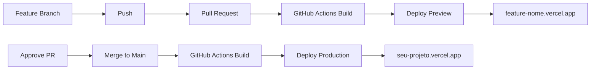

# Configuração do GitHub Actions para Deploy Automático

Este projeto está configurado com GitHub Actions para fazer deploy automático na Vercel.

## 🚀 Como Funciona

### 1. **Pull Request (Preview)**
- Quando você cria um PR para `main`
- GitHub Actions faz build e deploy para preview
- URL: `feature-nome.vercel.app` ou `hotfix-nome.vercel.app`

### 2. **Merge para Main (Produção)**
- Quando o PR é aprovado e mergeado para `main`
- GitHub Actions faz build e deploy para produção
- URL: `seu-projeto.vercel.app`

## ⚙️ Configuração dos Secrets

Você precisa configurar 3 secrets no seu repositório GitHub:

### Passo 1: Obter Vercel Token
1. Acesse [vercel.com/account/tokens](https://vercel.com/account/tokens)
2. Clique em "Create Token"
3. Dê um nome (ex: "GitHub Actions")
4. Copie o token gerado

### Passo 2: Obter Vercel Project ID
1. Acesse [vercel.com/dashboard](https://vercel.com/dashboard)
2. Selecione seu projeto
3. Vá em "Settings" → "General"
4. Copie o "Project ID"

### Passo 3: Obter Vercel Org ID
1. Ainda em "Settings" → "General"
2. Copie o "Team ID" (ou "User ID" se for projeto pessoal)

### Passo 4: Configurar no GitHub
1. Vá para seu repositório no GitHub
2. Clique em "Settings" → "Secrets and variables" → "Actions"
3. Clique em "New repository secret"
4. Adicione os 3 secrets:

```
VERCEL_TOKEN = seu_token_aqui
VERCEL_PROJECT_ID = seu_project_id_aqui
VERCEL_ORG_ID = seu_org_id_aqui
```

## 🔄 Workflow



## 📝 Exemplo de Uso

```bash
# 1. Criar feature branch
git checkout -b feature/nova-funcionalidade

# 2. Fazer alterações e commit
git add .
git commit -m "feat: nova funcionalidade"

# 3. Push e criar PR
git push origin feature/nova-funcionalidade
# → Criar PR no GitHub

# 4. GitHub Actions faz deploy automático
# → Preview disponível em: feature-nova-funcionalidade.vercel.app

# 5. Após aprovação e merge
# → GitHub Actions faz deploy para produção
# → Disponível em: seu-projeto.vercel.app
```

## ✅ Benefícios

- 🚀 Deploy automático a cada PR
- 🔄 Preview automático para cada branch
- 🎯 Deploy para produção apenas após merge
- 📱 URLs únicas para cada feature/hotfix
- 🧪 Teste em ambiente real antes do merge
- ⚡ Rollback fácil entre versões

## 🚨 Troubleshooting

### Erro: "Vercel authentication failed"
- Verifique se o `VERCEL_TOKEN` está correto
- Token pode ter expirado, gere um novo

### Erro: "Project not found"
- Verifique se o `VERCEL_PROJECT_ID` está correto
- Confirme se o projeto existe na Vercel

### Erro: "Organization not found"
- Verifique se o `VERCEL_ORG_ID` está correto
- Use "User ID" se for projeto pessoal
